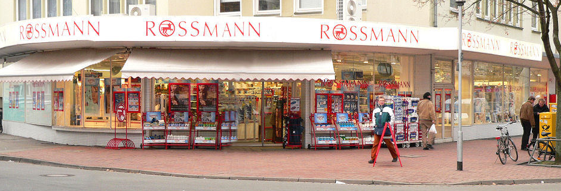
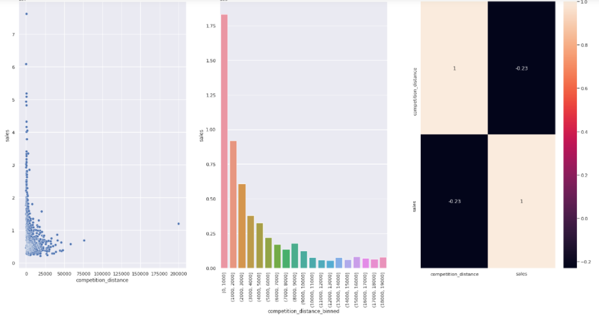
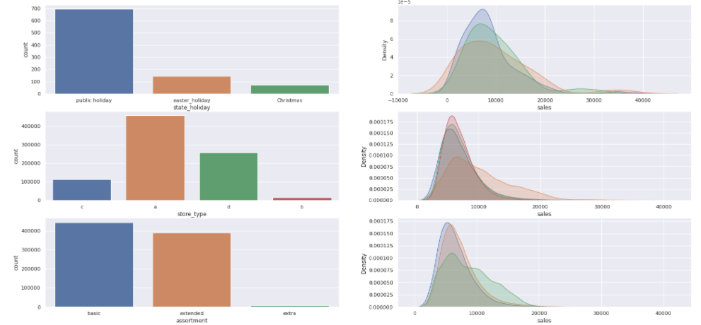
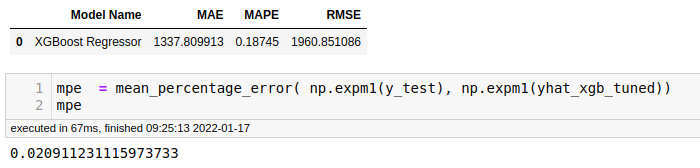

# Rossmann Sales Forescast

# Problema de negócio

A Rossmann opera em mais de 3.000 drogarias em 7 países europeus. Atualmente, os gerentes de loja da Rossmann têm a tarefa de prever suas vendas diárias com até seis semanas de antecedência. As vendas da loja são influenciadas por muitos fatores, incluindo promoções, competição, feriados escolares e estaduais, sazonalidade e localidade. Com milhares de gerentes individuais prevendo vendas com base em suas circunstâncias únicas, a precisão dos resultados pode ser bastante variada.

# Estratégia da Solução

Desenvolver um modelo de aprendizado de máquina que preveja com 95% de precisão na previsão de vendas.

**Etapa 01. Data Description** :  Utilizar métricas estatísticas para identificar as distribuições de dados.

**Etapa 02. Feature Engieneering** : Criar novas features que melhor descrevam o fenômeno.

**Etapa 03. Exploratory Data Analysis** : Explorar os dados para encontrar insights e recursos que melhor descrevem o fenômeno.

**Etapa 04. Feature Selection** : Selecionar a característica mais importante que melhor descreva o fenômeno.

**Etapa 05. Machine Learning Models** : Treinamento de modelo de aprendizado de máquina.

**Etapa 06. Tunning Hyper Parameters** : Encontrar os melhores valores de cada parâmetro do Modelo selecionado.

**Etapa 07. Convert Model Performance to Business Values** : Converter o desempenho do modelo de Machine Learning em um resultado comercial.

# Conjunto de Dados

O conjunto de dados está disponível na plataforma kaggle(https://www.kaggle.com/c/rossmann-store-sales/data).

# Principais insights de dados

As vendas crescem mais quanto menor a distância para um concorrente.

As vendas crescem mais para lojas do tipo "A" e "D".
As vendas crescem mais em feriados.
As vendas crescem mais para um sortimento menor.

## Modelos de Machine Learning 

Utilizei nesta etapa os seguintes modelos:
* Average - Baseline
* Linear Regression
* Lasso Regression
* Random Forest Regressor
* XGBoost Regressor

O resultado de desempenho indica que os modelos XGBoost e Random Forest Models.

## Desempenho dos Modelos

O modelo XGBoost apresenta o melhor desempenho e tempo de execução, com precisão de **98,1%**.

## Converter o desempenho do modelo em valores de negócios

Nos dados de teste, calculei a previsão e comparação com os piores e melhores cenários. O modelo traz dados de segurança para a decisão do CEO de investir na reforma de vendas.

# Contato

Vanessa Paula - Cientista de Dados em formação. 

vpaula247@gmail.com

Linkedin: https://www.linkedin.com/in/vanessa-paula-b826312a/
